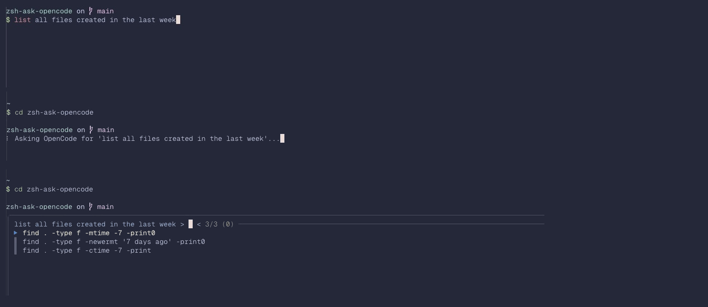

# zsh-ask-opencode

A simple ZSH plugin that integrates OpenCode AI with your shell, allowing you to generate shell commands using natural language. Press `Ctrl+O` to transform any text in your command line into optimized shell commands.



## Features

- 🤖 **AI-powered command generation** using OpenCode API
- ⚡ **Interactive selection** with fzf for choosing between 3 ranked options
- 🎯 **Ranked by best practices** - speed, safety, and reliability
- 🎨 **Smooth UX** with animated spinner feedback
- 🔧 **Easy configuration** for model selection and debug output
- ⌨️ **Single keybinding** (Ctrl+O) for quick access

## Outcomes

- **Faster command composition** - generate complex shell commands instantly
- **Learn shell commands** - see how experts would approach tasks
- **Interactive choice** - pick the best command from 3 ranked options
- **No command execution** - you control what gets run

## Dependencies

This plugin requires:

- **opencode** - OpenCode CLI for generating commands
- **fzf** (optional) - For interactive command selection (defaults to first option if not installed)

### Installing Dependencies

#### opencode

Visit [OpenCode documentation](https://opencode.dev) for installation instructions specific to your system.

#### fzf

```bash
# macOS with Homebrew
brew install fzf

# Linux with apt
sudo apt-get install fzf

# Or via your package manager
# https://github.com/junegunn/fzf#installation
```

## Installation

### Oh My Zsh

```bash
git clone https://github.com/andreacasarin/zsh-ask-opencode.git $ZSH_CUSTOM/plugins/zsh-ask-opencode
```

Then add `zsh-ask-opencode` to the plugins array in your `~/.zshrc`:

```bash
plugins=(... zsh-ask-opencode)
```

Reload your shell:

```bash
source ~/.zshrc
```

### Antidote

Add to your `~/.zsh_plugins.txt`:

```
andreacasarin/zsh-ask-opencode
```

Then run:

```bash
antidote bundle
```

### Manual Installation

Clone the repository:

```bash
git clone https://github.com/andreacasarin/zsh-ask-opencode.git ~/zsh-ask-opencode
```

Source it in your `~/.zshrc`:

```bash
source ~/zsh-ask-opencode/zsh-ask-opencode.plugin.zsh
```

## Usage

Simply type what you want to do, then press `Ctrl+O`:

```bash
$ list all files modified in the last 24 hours
^O
```

The plugin will:

1. Show a spinner while asking OpenCode
2. Generate 3 ranked command options
3. Display an fzf menu to select your preferred command
4. Insert the selected command into your command line
5. You can review and press Enter to execute, or edit further

### Examples

```bash
$ compress all jpg files in this directory to 50% size
^O
# Generates: convert *.jpg -quality 50% compressed.jpg

$ find all python files with more than 100 lines
^O
# Generates: find . -name "*.py" -exec wc -l {} + | awk '$1 > 100'

$ restart the docker container named web
^O
# Generates: docker restart web
```

## Configuration

### Model Selection

Change the AI model used for generation by setting `ASK_OPENCODE_MODEL`:

```bash
# In your ~/.zshrc (before sourcing the plugin)
export ASK_OPENCODE_MODEL="github-copilot/gpt-5-mini"  # default
export ASK_OPENCODE_MODEL="github-copilot/gpt-5"      # more powerful
```

Available models depend on your OpenCode configuration.

### Debug Mode

Enable debug output to see raw API responses and parsed commands:

```bash
# In your ~/.zshrc
export ASK_OPENCODE_DEBUG=1
```

This will print:

- Raw output from OpenCode (NUL-separated format)
- Parsed command array after splitting
- Helpful for troubleshooting

Example debug output:

```
[ask_opencode] Raw output (NUL-separated):
     1	command1
     2	command2
     3	command3

[ask_opencode] Parsed commands:
     1	ls -lah
     2	ls -la
     3	ls -l
```

### Keybinding

The default keybinding is `Ctrl+O`. To change it, add to your `~/.zshrc`:

```bash
# Change keybinding to Ctrl+G instead
bindkey '^G' ask_opencode
```

## Troubleshooting

### "opencode: command not found"

Ensure OpenCode is installed and in your `$PATH`:

```bash
which opencode
# If not found, install it per OpenCode documentation
```

### No commands generated

Check debug output:

```bash
ASK_OPENCODE_DEBUG=1 your_prompt_here
^O
```

Look for error messages from OpenCode in the terminal.

### Commands not appearing in fzf

If fzf is not installed, the plugin uses the first generated command by default. Install fzf to enable selection:

```bash
brew install fzf  # or your package manager
```

### Plugin not loading

Verify the file is being sourced:

```bash
# For Oh My Zsh
ls -la $ZSH_CUSTOM/plugins/zsh-ask-opencode/

# For manual installation
grep "zsh-ask-opencode" ~/.zshrc
```

Then reload:

```bash
source ~/.zshrc
exec zsh
```

## Contributing

Contributions are welcome! Please feel free to submit a Pull Request.

## License

MIT License - see [LICENSE](LICENSE) for details

## Author

Created by [Andrea Casarin](https://www.andreacasarin.com)

## Related

- [OpenCode](https://opencode.dev) - The AI command generation service
- [fzf](https://github.com/junegunn/fzf) - Interactive fuzzy finder
- [Oh My Zsh](https://ohmyz.sh/) - ZSH framework
- [Antidote](https://getantidote.github.io/) - ZSH plugin manager
